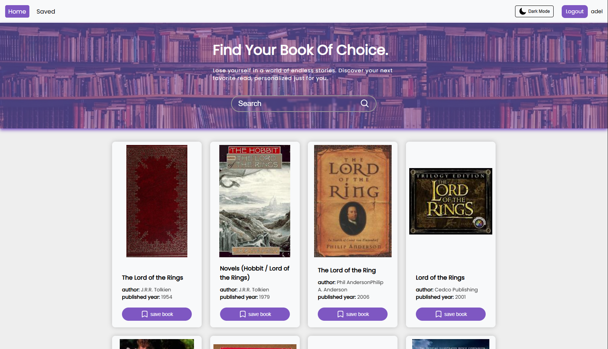
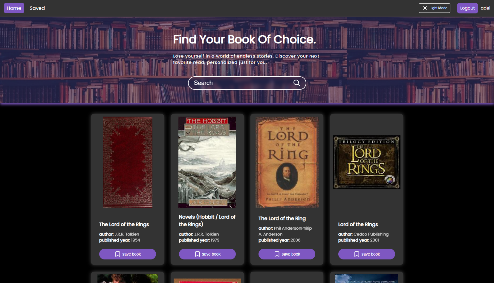

# 📚 MakTab Library

MakTab Library is a responsive, theme-switchable book management web application where users can browse, search, and save books they like. The application offers both **dark** and **light modes** and features **user login** functionality.

## 🔗 Live Preview

[**View MakTab Library Live**](https://library-ashen-nine.vercel.app/)

## 🛠️ Setup Instructions

Follow these steps to run the project locally on your machine:

### 1. 📁 Clone the Repository

```bash
git clone https://github.com/adel-nodehi/library.git
cd MakTab-Library
```

### 2. 📦 Install Dependencies

```bash
npm install
```

### 3. ▶️ Run the App

```bash
npm run dev
```

then open http://localhost:5173/ in your browser.

### 4. 🧪 Running the with-json-server Branch (Optional)

If you want to run the **with-json-server** branch, you must start the JSON server manually.

> 🧵 First, open a **new terminal window** in the project root, then run the command below:

```bash
npm run server
```

## 🚀 Features

- 🔎 Browse and search books
- ❤️ Save liked books (user-specific)
- 🌗 Toggle between Dark and Light themes
- 🔐 Simple login system

## 🧰 Technologies Used

- **React**
- **React Router DOM**
- **Context API** (for state management)
- **Local Storage** (main branch)
- **JSON Server** (with-json-server branch)

## 🌳 Branches Overview

| Branch                                                                                      | Description                                                                              |
| ------------------------------------------------------------------------------------------- | ---------------------------------------------------------------------------------------- |
| `main`                                                                                      | 🌐 **Deployed branch**: Uses **Local Storage** to store books and user data              |
| [`with-json-server`](https://github.com/your-username/MakTab-Library/tree/with-json-server) | 🧪 Development branch: Uses **JSON Server** and stores data within the project directory |

## 🖼️ Screenshots

- Home page
  

- Search bar
  

- Dark mode
  
